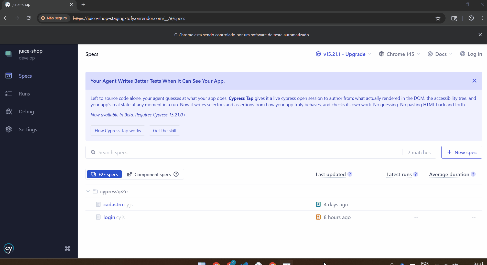

# 🧪 Laboratório Prático de Testes de Software (API & E2E) - OWASP Juice Shop

Este repositório documenta o meu estudo e aplicação prática de **Garantia de Qualidade (QA)** e **Automação de Testes**. O objetivo principal deste laboratório foi construir, do zero, um fluxo completo de testes automatizados para a aplicação **OWASP Juice Shop**, cobrindo desde a camada de API até a interface web (E2E).

---

## 📌 Visão Geral do Laboratório

O projeto consiste na automação e validação contínua da aplicação em três frentes:

1. **Testes de API (Postman, Newman e Postman CLI):**
   * **Fluxo Encadeado de Dados:** Criação de scripts em JavaScript para capturar dados dinâmicos do cadastro (`userId`, `email_dinamico`) e reutilizá-los nas chamadas de login e consulta.
   * **Autenticação:** Captura automática do Token JWT gerado no login para autorização das requisições protegidas (*Bearer Token*).
   * **Cenários de Teste:** Cobertura do caminho feliz (sucesso) e caminhos de erro (falha de login e credenciais inválidas).

2. **Testes de Interface / E2E (Cypress):**
   * Automação do formulário de cadastro de utilizadores com validação do fluxo completo.
   * Uso de dados dinâmicos (`Date.now()`) para garantir a independência de cada execução e evitar conflitos de e-mails duplicados.
   * Validação de regras de negócio, como divergência de senhas e preenchimento de campos obrigatórios.

3. **Ambiente e Execução (Render, Docker e GitHub Actions):**
   * A aplicação alvo foi implantada no ambiente de Staging na nuvem através do **Render**.
   * Testes executados localmente via **WSL2 (Ubuntu)** e em containers com **Docker**.
   * Execução automatizada e contínua dos testes de **API (Newman)** e **E2E (Cypress)** na nuvem via **GitHub Actions**.

---

## 🛠️ Ferramentas Utilizadas

* **Testes de API:** Postman, Postman CLI, Newman
* **Testes E2E:** Cypress (JavaScript)
* **Gerenciamento de Pacotes:** Node.js (v22) / NPM
* **Ambiente & Infraestrutura:** WSL2 (Ubuntu), Docker, Render (Staging)
* **Integração Contínua:** GitHub Actions
* **Versionamento:** Git e GitHub

---

## ⚙️ Pré-requisitos e Instalação

* **Node.js:** Versão 22 ou superior recomendada.

Para instalar as dependências do projeto localmente garantindo compatibilidade com a aplicação:

  npm install --legacy-peer-deps

---

## 🚀 Como Executar os Testes de API (Newman)

Para rodar a coleção de testes de API diretamente no terminal apontando para o ambiente de Staging na nuvem:

  npx newman run tests/juice-shop.postman_collection.json -e tests/juice-shop.postman_environment.json

---

## 💻 Como Executar os Testes de Interface (Cypress)

### Executar todos os testes no terminal (Modo Headless):

Executar todos os testes no terminal (Modo Headless):
  npx cypress run

Executar um arquivo específico no terminal:
  npx cypress run --spec "cypress/e2e/cadastro.cy.js"

Abrir a interface gráfica do Cypress:
  npx cypress open

---

## 📹 Demonstração dos Testes de Interface (Cypress)

Abaixo estão as demonstrações visuais da execução automatizada dos cenários E2E na interface do sistema:

### 1. Fluxo de Cadastro de Usuário (`cadastro.cy.js`)

### 2. Fluxo de Login (`login.cy.js`)

---

## 📚 Aprendizados e Desafios Resolvidos

* **Tratamento de Dados Dinâmicos:** Adoção de variáveis de tempo (`$timestamp` e `Date.now()`) nos testes de API e E2E para evitar testes quebrados por dados já existentes na base.

* **Encadeamento de Requisições:** Entendimento prático de como manipular variáveis de ambiente (`pm.environment.set`) para repassar tokens de autenticação entre diferentes endpoints.

* **Automação no Pipeline de CI/CD:** Configuração do GitHub Actions (Node 22) para preparar o ambiente, gerenciar dependências de legado com `--legacy-peer-deps` e disparar as suítes de teste do Newman e do Cypress em cada integração na branch `develop`.

---

## 📫 Contato

* **LinkedIn:** https://www.linkedin.com/in/felipe-almeida-soares/
* **GitHub:** https://github.com/testerqafelipe
