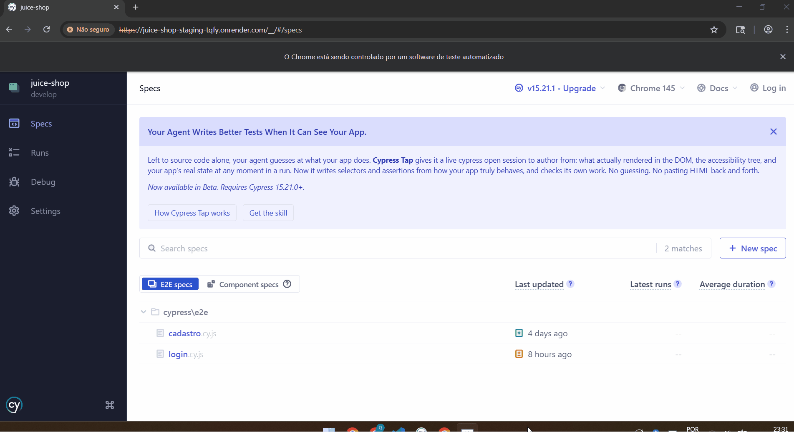
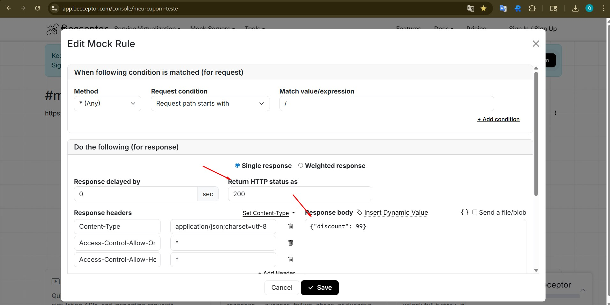

# 🧪 Laboratório Prático de Testes de Software (API, E2E & Mocking) - OWASP Juice Shop

Este repositório documenta o meu estudo e aplicação prática de **Garantia de Qualidade (QA)** e **Automação de Testes**. O objetivo principal deste laboratório foi construir, do zero, um fluxo completo de testes para a aplicação **OWASP Juice Shop**, cobrindo desde a camada de API até a interface web (E2E) e simulação de tráfego/mocking.

---

## 📌 Visão Geral do Laboratório

O projeto consiste na automação, interceptação e validação da aplicação em quatro frentes principais:

1. **Testes de API (Postman, Newman e Postman CLI):**
   * **Fluxo Encadeado de Dados:** Criação de scripts em JavaScript para capturar dados dinâmicos do cadastro (`userId`, `email_dinamico`) e reutilizá-los nas chamadas de login e consulta.
   * **Autenticação:** Captura automática do Token JWT gerado no login para autorização das requisições protegidas (*Bearer Token*).
   * **Cenários de Teste:** Cobertura do caminho feliz (sucesso) e caminhos de erro (falha de login e credenciais inválidas).

2. **Testes de Interface / E2E (Cypress):**
   * Automação do formulário de cadastro de utilizadores com validação do fluxo completo.
   * Uso de dados dinâmicos (`Date.now()`) para garantir a independência de cada execução e evitar conflitos de e-mails duplicados.
   * Validação de regras de negócio, como divergência de senhas e preenchimento de campos obrigatórios.

3. **Interceptação de Tráfego & Mocking de API (Requestly + Beeceptor):**
   * **Testes de Contrato e Tratamento no Front-end:** Uso de redirecionamento local para simular respostas customizadas em JSON (`{"discount": 99}`).
   * **Validação de Regra de Negócio (Checkout):** Teste de resiliência e integridade para garantir que manipulando respostas no lado do cliente (Client-side) o servidor real (Back-end) continue cobrando os valores corretos.

4. **Ambiente e Execução (Render, Docker e GitHub Actions):**
   * A aplicação alvo foi implantada no ambiente de Staging na nuvem através do **Render**.
   * Testes executados localmente via **WSL2 (Ubuntu)** e em containers com **Docker**.
   * Execução automatizada e contínua dos testes de **API (Newman)** e **E2E (Cypress)** na nuvem via **GitHub Actions**.

---

## 🛠️ Ferramentas Utilizadas

- **Testes de API:** Postman, Postman CLI, Newman
- **Testes E2E:** Cypress (JavaScript)
- **Interceptação & Mocking:** Requestly, Beeceptor, Chrome DevTools
- **Gerenciamento de Pacotes:** Node.js (v22) / NPM
- **Ambiente & Infraestrutura:** WSL2 (Ubuntu), Docker, Render (Staging)
- **Integração Contínua:** GitHub Actions
- **Versionamento:** Git e GitHub

---

## ⚙️ Pré-requisitos e Instalação

- **Node.js:** Versão 22 ou superior recomendada.

Para instalar as dependências do projeto localmente garantindo compatibilidade com a aplicação:

    npm install --legacy-peer-deps

---

## 🚀 Como Executar os Testes de API (Newman)

Para rodar a coleção de testes de API diretamente no terminal apontando para o ambiente de Staging na nuvem:

    npx newman run tests/juice-shop.postman_collection.json -e tests/juice-shop.postman_environment.json

---

## 💻 Como Executar os Testes de Interface (Cypress)

### Executar todos os testes no terminal (Modo Headless):

    npx cypress run

### Executar um arquivo específico no terminal:

    npx cypress run --spec "cypress/e2e/cadastro.cy.js"

### Abrir a interface gráfica do Cypress:

    npx cypress open

---

## 📹 Demonstração dos Testes de Interface (Cypress)

Abaixo estão as demonstrações visuais da execução automatizada dos cenários E2E na interface do sistema:

### 1. Fluxo de Cadastro de Usuário (`cadastro.cy.js`)

### 2. Fluxo de Login (`login.cy.js`)

---

## 🔬 Estudo de Caso: Mocking de API e Validação no Checkout

Além da automação tradicional, executei um teste de resiliência e integração simulando a injeção de um cupom com 99% de desconto através do redirecionamento de tráfego.

### 🎯 Objetivos
- Verificar como o **Front-end** reage ao receber retornos fora do padrão em formato JSON (`{"discount": 99}`).
- Validar se o **Back-end** recalcula os dados no banco durante o checkout, impedindo fraudes financeiras geradas no cliente.

### 📸 Evidências Práticas

#### 1. Configuração do Mock de Resposta (Beeceptor + Requestly)

#### 2. Comportamento do Front-end (Desconto de 99% exibido na interface)

#### 3. Validação de Segurança no Back-end (Cobrança do valor integral no Checkout)

### 📊 Resultados do Teste

| Etapa | Comportamento Observado | Diagnóstico de QA |
| :--- | :--- | :--- |
| **Aplicação do Cupom (Front-end)** | O Front-end aceitou a resposta mockada do Beeceptor e exibiu a mensagem de 99% de desconto aplicado. | **Mapeamento de Contrato:** O Front-end processa os campos JSON recebidos da API corretamente para exibição na UI. |
| **Checkout Final (Back-end)** | Ao clicar em finalizar a compra, o servidor recalculou o carrinho a partir do banco e cobrou o valor original do produto. | **Sucesso em Segurança e Regra de Negócio:** O servidor ignora o estado visual do cliente e mantém a integridade da transação. |

---

## 📚 Aprendizados e Desafios Resolvidos

- **Tratamento de Dados Dinâmicos:** Adoção de variáveis de tempo (`$timestamp` e `Date.now()`) nos testes de API e E2E para evitar testes quebrados por dados já existentes na base.

- **Encadeamento de Requisições:** Entendimento prático de como manipular variáveis de ambiente (`pm.environment.set`) para repassar tokens de autenticação entre diferentes endpoints.

- **Mocking de APIs e Interceptação de Rede:** Uso prático do Requestly e Beeceptor para isolar testes de interface e validar regras de negócio no Back-end sem necessidade de alterar o código da aplicação.

- **Automação no Pipeline de CI/CD:** Configuração do GitHub Actions (Node 22) para preparar o ambiente, gerenciar dependências de legado com `--legacy-peer-deps` e disparar as suítes de teste do Newman e do Cypress em cada integração na branch `develop`.

---

## 📫 Contato

- **LinkedIn:** https://www.linkedin.com/in/felipe-almeida-soares/
- **GitHub:** https://github.com/testerqafelipe